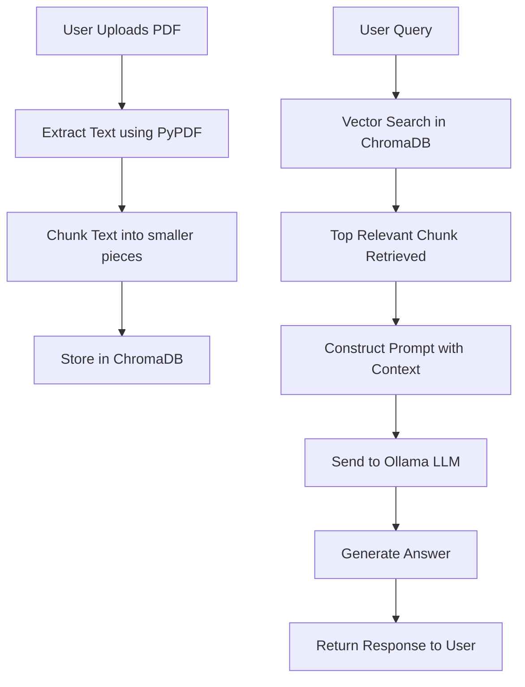

# Local RAG AI Assistant (Privacy-First)

A privacy-focused Retrieval-Augmented Generation (RAG) system that allows you to query PDF documents locally using LLMs — without sending data to external APIs.

Built to understand how modern AI systems combine **vector search + LLM reasoning** in real-world applications.

---

## 🚨 Problem This Solves

LLMs alone have limitations:

- ❌ No access to your private documents  
- ❌ Hallucinate answers without context  
- ❌ Sending data to cloud APIs raises privacy concerns  

This project solves it by:

👉 Combining **local document search + LLM reasoning**

---

## 🧠 How It Works

1. Upload a PDF  
2. Extract text  
3. Split into chunks  
4. Store in vector database  
5. Retrieve most relevant chunk for a query  
6. Pass context + question to LLM  
7. Generate accurate answer  

---

## ⚙️ Architecture

### 📂 Project Flow

🧩 Tech Stack
ollama run tinyllama

(You can also use mistral, llama3, etc.)

🧪 Example Workflow

Upload a PDF

Ask:

What is the main idea of this document?

Get AI-generated answer based only on your document

🚀 Future Improvements

Multi-document querying

Better chunking (semantic splitting)

Top-K retrieval instead of 1 result

Streaming responses

UI (React / Streamlit)

Embedding optimization

📌 Design Decisions
Why chunking?

LLMs have context limits. Chunking ensures relevant data fits within prompt size.

Why top-1 retrieval?

Simple and fast. Can be extended to top-K for better accuracy.

Why local LLM?

Ensures privacy + zero external dependency

💡 What I Learned

How RAG systems work internally

How vector databases enable semantic search

How to control LLM outputs using context

Real-world AI system design patterns
